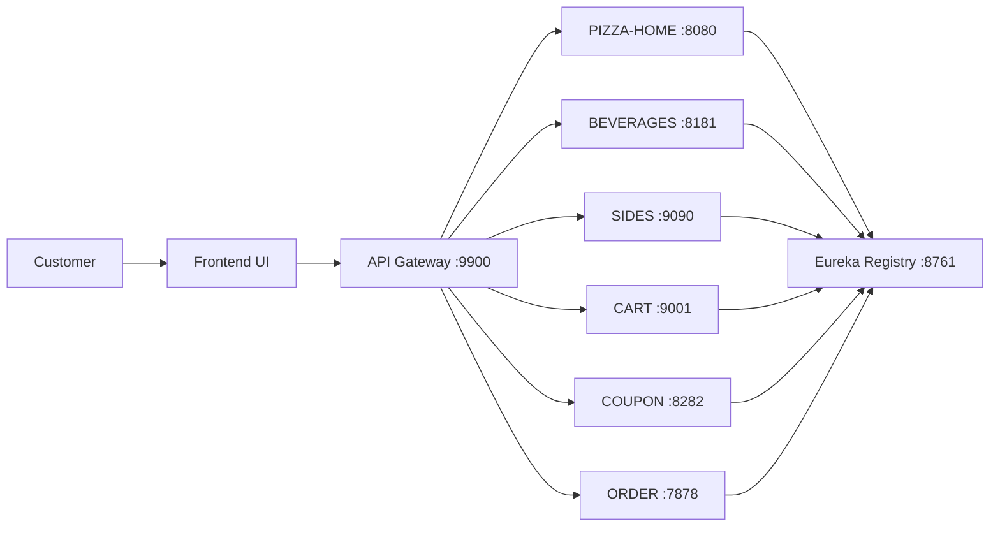
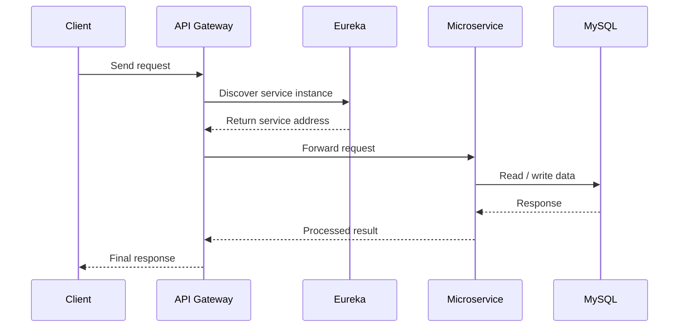

# Pizza Ordering System

A polished full-stack pizza ordering platform built with Spring Boot microservices on the backend and a frontend experience for customers to browse products, manage cart, apply coupons, and place orders.

## Why this project stands out

- Clean microservice-based structure for independent business capabilities
- Centralized entry through an API gateway
- Service discovery powered by Eureka
- Separate services for pizza, beverages, sides, cart, coupons, and orders
- A frontend layer that provides a complete customer-facing experience
- Easy to extend into a full production-style e-commerce platform

## Architecture Overview

## Request Flow

## Service Modules

- [api-gateway](api-gateway) - Routes incoming requests to the correct backend service
- [service-registry](service-registry) - Eureka-based service discovery server
- [PizzaHomeStore](PizzaHomeStore) - Core pizza store service
- [beverages](beverages) - Beverage catalog and management
- [sides-service](sides-service) - Side dish service
- [cart-service](cart-service) - Shopping cart operations
- [coupon](coupon) - Coupon and discount handling
- [order-service 4](order-service%204) - Order placement and processing

## Technology Stack

- Java 17+
- Spring Boot
- Spring Cloud Gateway
- Spring Cloud Netflix Eureka
- Spring Data JPA
- MySQL
- Maven
- RESTful APIs
- Frontend UI for customer interaction

## Service Ports

- Service Registry: 8761
- API Gateway: 9900
- Pizza Home Store: 8080
- Beverages Service: 8181
- Sides Service: 9090
- Cart Service: 9001
- Coupon Service: 8282
- Order Service: 7878

## Prerequisites

- Java 17 or later
- Maven
- MySQL running locally
- Required databases created before running the services (for example, `testdb` and `orderdb`)

## Quick Start

1. Start the service registry:
   - `cd service-registry`
   - `./mvnw spring-boot:run`

2. Start the API gateway:
   - `cd api-gateway`
   - `./mvnw spring-boot:run`

3. Start the backend services in separate terminals:
   - `cd PizzaHomeStore && ./mvnw spring-boot:run`
   - `cd beverages && ./mvnw spring-boot:run`
   - `cd sides-service && ./mvnw spring-boot:run`
   - `cd cart-service && ./mvnw spring-boot:run`
   - `cd coupon && ./mvnw spring-boot:run`
   - `cd "order-service 4" && ./mvnw spring-boot:run`

4. Launch the frontend UI and connect it to the gateway at:
   - `http://localhost:9900`

5. Use the frontend to browse pizzas, add items to the cart, apply coupons, and place orders.

## Notes

- A frontend archive is also present at the repository root as `FrontEnd.zip`.
- If your local MySQL credentials differ from the defaults, update the relevant configuration files before launching the services.
